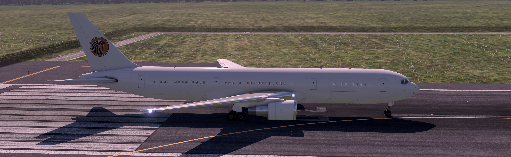

# paintkit-767-300ER-project-76

My version of default project76 paint kit (https://github.com/TheFirstAahz/767-300ER)

My version includes:
  *  SPECIAL LAYER FOR DOORS, WINDOWS
  *  DIFFRENT ALAIGMENT OF RIVETS (separated layer)
  *  RED LINEs AT LANDING GEAR DOORS (separated layer)
  *  WARNINGS (separated layer included on engines.psd and 76Nose.psd)
  *  IT REMOVE BLACK LINES WHEN ONE PART OF FUELSELAGE CONNECT TO ANOTHER

!i included engine_NML becouse it makes ring of engine nice and shyn!

-
That's how paint kit looks on airplane

-

Join project76 Discord (https://discord.gg/ncVB3JcrBn)
-
If you find any misstakes/issues tag me in project76 discord server :)
